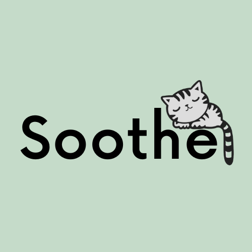

   

# Soothe

Our Website: https://cyberkiwii.github.io/soothe/

ADD A SUMMARY OF WHAT SOOTHE IS.

BRYCE

Soothe was built primarily using HTML and CSS.

## History

Soothe was created for a group project for the Fall 2022 Cyber Security & IT Externship. The Externship was organized by the Greater Phoenix Chamber Foundation. 
https://phoenixchamber.com/

## Overview

### Pitch
An emotion and mental health toolkit that aims to connect individuals with creative yet simple methods to alleviate, cope, and find helpful solutions to their distress.

### Slideshow 
https://docs.google.com/presentation/d/1bYwYd-331Fuz4UZBMPVvYI4RkuD7eGSc25MWau9aQSM/edit?usp=sharing

## Creators + Contributors

Created by Gracie Gallegos, Alaa Eltahir, Bryce Burgess, and Danny Svoboda.

For the group project, after brainstorming ideas we decided we want to combine mental health and technology. The idea came about to create a app or website as a central place for people to acess mental health and emotional coping tools for free. Our project is still in the beginning stages, as most of our members do not know how to program. Gracie has previously worked on projects creating websites, and suggested that we start with a website. 

Our team works very well together dispite dispite the different challenges that might come up. Danny and Alaa did the majority of the research, while Danny designed most of the icons and sketches, and Gracie programmed the site.

(See the 'ABOUT' page of our website to learn more about the team members and to contact us.)

# The Research

## Design

Our website was built to have a very simple interface that is easy on the eyes. We used calming colors like pastels, which are scientifically proven to relaxing. (Check out some of the links about this in our blog!) INSERT BLOG LINK 

We chose to use kittens and cats to further represent the Soothe theme. 

## Data

One of the things we did to collect data for this project was to ask our externship cohorts to fill out a survey. Our externship had about 20 externs from very different and diverse backgrounds. We had people of many races, ages, and genders particpating. This was the perfect group to collect data from.

Our survey had 16 annonymous responses. For more information feel free to look at some of our data: https://docs.google.com/document/d/1XKWKShgVBF46UtvAIKMrddTW6A6TS9WJwhH5y2y4XWw/edit?usp=sharing

# Features

Soothe currently gives users the option to choose between 5 emotions that they might be dealing with:
- Anxiety
- Sadness / Depression
- Stress
- Anger
- Confusion

From there users can choose between 5 tools to hopefully help them cope:
- Music
- Breathing
- Journaling
- Contacts
- Exercise / Physical Activity

For now, we kept the tools generic, but we would like to better customize these to the specific emotions in the future (see 'Future of Soothe')
  

# Future of Soothe

In the future, we would like to refine and add features to our website. If you have any ideas, please feel free to contact us!

Some of the things we would like to do are:
- Have an app version 
- More designs and features (such as in-app / in-website journaling, sign-in feature, guided breathing, direction to users' favorite playlists in their preferred music app, etc.)
- We would also like to have the option for users to add their own tools 
- Users take a survey that tell them how they feel
- We would like to expand more and add to the emotion options.
- Create more specific tools to certain emotions

